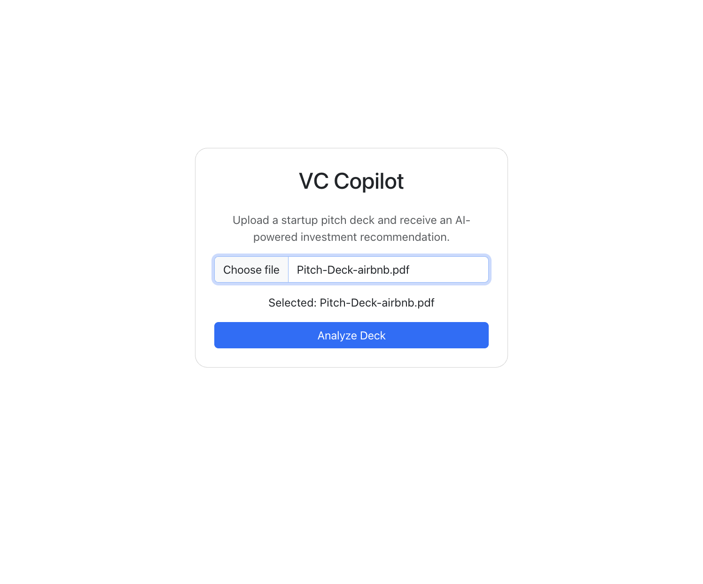
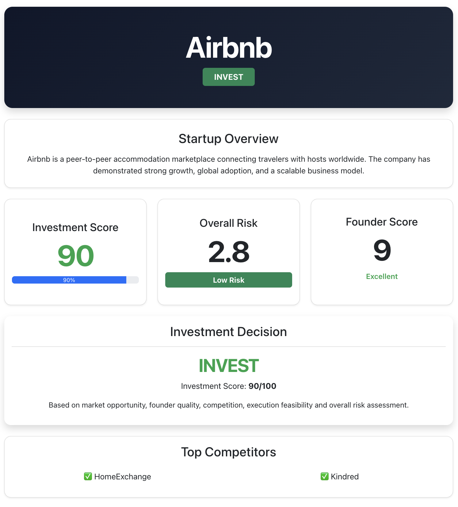
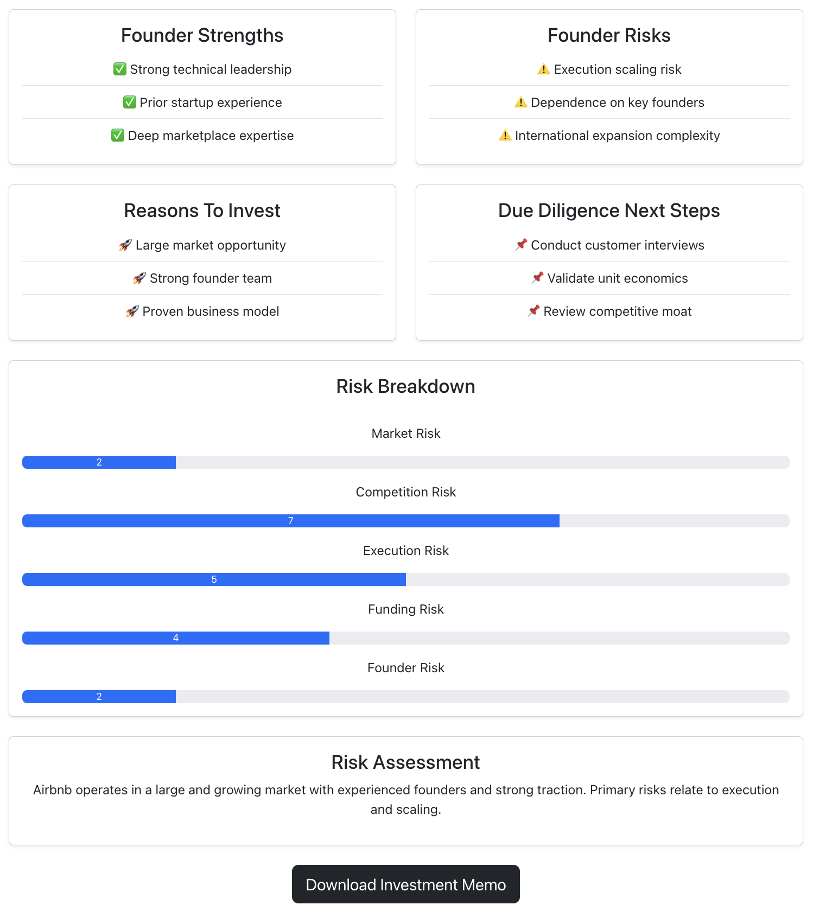
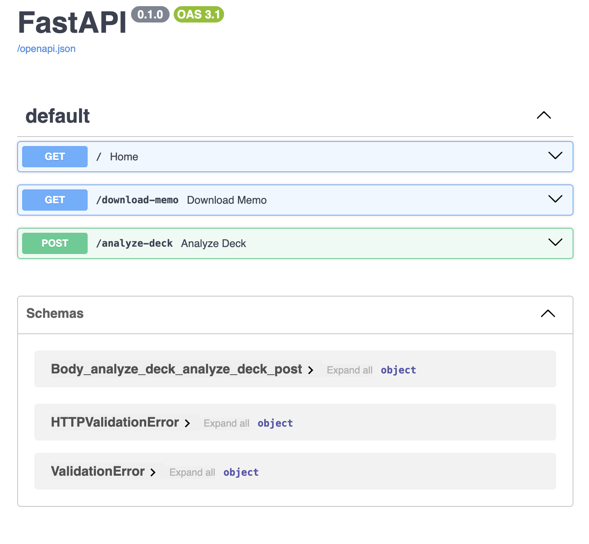

# 🚀 VC Copilot – AI-Powered Venture Capital Investment Platform

VC Copilot is an AI-powered Venture Capital analysis platform that automatically evaluates startup pitch decks and generates investment recommendations using a multi-agent architecture built with LangGraph, FastAPI, React, Gemini, and Tavily.

The platform enables investors, analysts, and founders to upload startup pitch decks and receive detailed insights including market analysis, competitor research, founder assessment, risk evaluation, and investment recommendations.

---

# 📌 Features

### 📄 Pitch Deck Analysis

* Upload startup pitch decks in PDF format
* Automatic slide extraction and processing
* AI-powered pitch deck understanding using Gemini Vision

### 📊 Market Research

* Industry market size estimation
* CAGR (Compound Annual Growth Rate) analysis
* Market attractiveness scoring

### 🏆 Competitor Analysis

* Identification of major competitors
* Competitive landscape evaluation
* Competition intensity scoring

### 👥 Founder Evaluation

* Founder background verification using Tavily Search
* Founder strength assessment
* Founder risk assessment
* Founder scoring mechanism

### ⚠️ Risk Assessment

* Market Risk
* Competition Risk
* Execution Risk
* Funding Risk
* Founder Risk

### 💰 Investment Committee

* Investment score generation
* INVEST / DO NOT INVEST recommendation
* Due diligence recommendations
* Investment rationale generation

### 📑 Investment Memo

* Automatically generated downloadable investment memo
* Structured VC-style investment report

---

# 🏗️ System Architecture

```text
Pitch Deck PDF
       │
       ▼
PDF to Images
       │
       ▼
Batch Slide Analysis
(Gemini Vision)
       │
       ▼
Startup Information Extraction
       │
       ▼
LangGraph Multi-Agent Workflow
       │
       ├── Market Research Agent
       ├── Competitor Analysis Agent
       ├── Founder Analysis Agent
       ├── Risk Assessment Agent
       └── Investment Committee Agent
       │
       ▼
Investment Recommendation
       │
       ▼
Interactive VC Dashboard
```

---

# 🧠 Multi-Agent Workflow

The project uses LangGraph to orchestrate multiple AI agents.

## 1. Market Research Agent

Responsibilities:

* Market size estimation
* Industry trend analysis
* CAGR calculation
* Market attractiveness scoring

Tools:

* Tavily Search
* Gemini

---

## 2. Competitor Analysis Agent

Responsibilities:

* Competitor identification
* Competitive intensity assessment
* Market positioning evaluation

Tools:

* Tavily Search
* Gemini

---

## 3. Founder Analysis Agent

Responsibilities:

* Founder verification
* Founder scoring
* Strength and risk identification

Tools:

* Tavily Search
* Gemini

---

## 4. Risk Assessment Agent

Responsibilities:

* Market risk evaluation
* Competition risk evaluation
* Execution risk evaluation
* Funding risk evaluation
* Founder risk evaluation

Tools:

* Gemini

---

## 5. Investment Committee Agent

Responsibilities:

* Investment scoring
* Final recommendation
* Due diligence planning
* Investment rationale generation

Tools:

* Gemini

---

# 🛠️ Tech Stack

## Frontend

* React.js
* React Bootstrap
* React Router
* Axios

## Backend

* FastAPI
* Python

## AI / LLM

* Google Gemini 2.5 Flash
* OpenRouter (Fallback LLM)

## Agent Framework

* LangGraph
* LangChain

## Search & Research

* Tavily Search API

## Document Processing

* PDF2Image
* Pillow (PIL)

---

# 📸 Application Screenshots

## Upload Page



---

## Analysis Dashboard



---

## Investment Recommendation



---

## Backend API (Swagger)



---

# 🚀 Installation

## Clone Repository

```bash
git clone https://github.com/YOUR_USERNAME/vc-copilot.git

cd vc-copilot
```

---

# Backend Setup

```bash
cd backend

python -m venv venv

source venv/bin/activate
```

Install dependencies:

```bash
pip install -r requirements.txt
```

Create:

```bash
.env
```

Add:

```env
GEMINI_API_KEY=your_key

OPENROUTER_API_KEY=your_key

TAVILY_API_KEY=your_key
```

Run backend:

```bash
uvicorn main:app --reload
```

---

# Frontend Setup

```bash
cd frontend

npm install

npm run dev
```

Frontend:

```text
http://localhost:5173
```

Backend:

```text
http://localhost:8000
```

---

# Example Workflow

1. Upload startup pitch deck PDF
2. Slides are extracted and analyzed
3. Startup information is generated
4. Market research is performed
5. Competitor analysis is performed
6. Founder evaluation is performed
7. Risk assessment is generated
8. Investment recommendation is produced
9. Investment memo is downloadable

---

# Example Output

```json
{
  "startup_name": "Airbnb",
  "investment_score": 89,
  "recommendation": "INVEST",
  "founder_score": 9,
  "overall_risk": 3.1,
  "competitors": [
    "HomeExchange",
    "Kindred"
  ]
}
```

---

# Key Learning Outcomes

This project demonstrates:

* Multi-Agent AI Systems
* Agent Orchestration using LangGraph
* Retrieval-Augmented Research
* Large Language Model Integration
* Startup Investment Analysis
* Full Stack Development
* FastAPI Backend Development
* React Frontend Development
* AI Product Design

---

# Future Improvements

* Support for PowerPoint uploads
* Investment memo export enhancements
* Startup benchmarking against VC portfolios
* Startup trend analytics
* Portfolio recommendation engine
* Investor collaboration dashboard

---

# Author

**Ankita Dash**

B.Tech Computer Science & Engineering
Indian Institute of Technology Jammu

GitHub: https://github.com/YOUR_USERNAME

LinkedIn: https://linkedin.com/in/YOUR_PROFILE

---

# License

This project is licensed under the MIT License.
